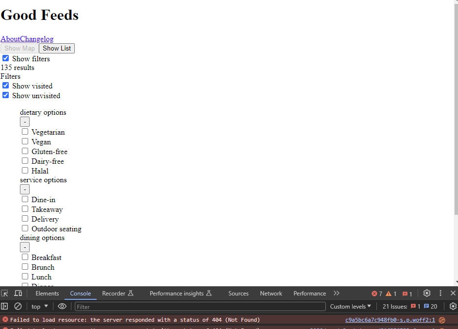
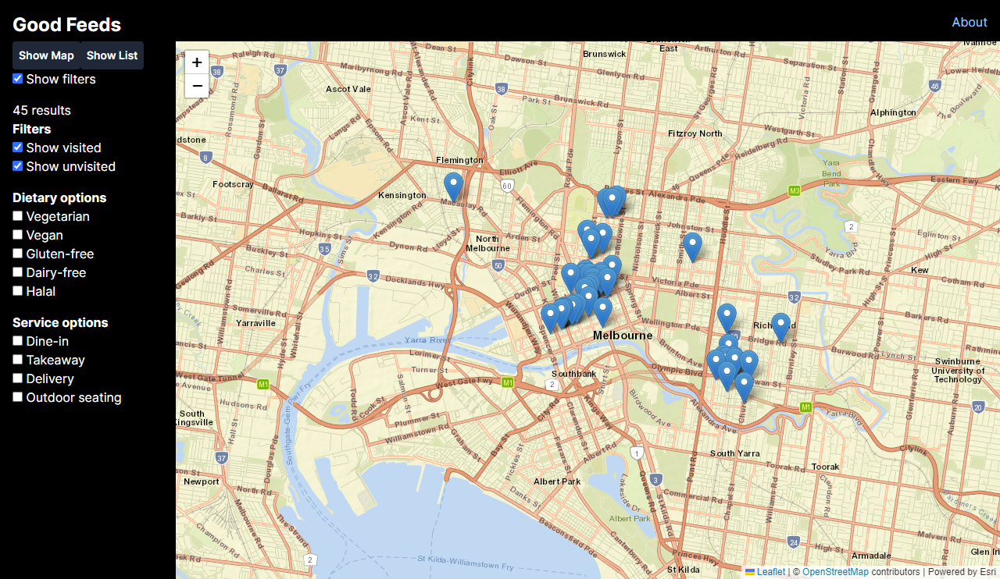
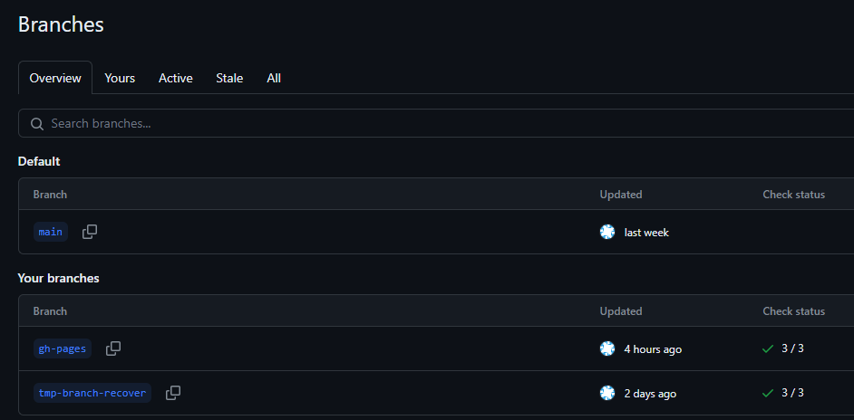
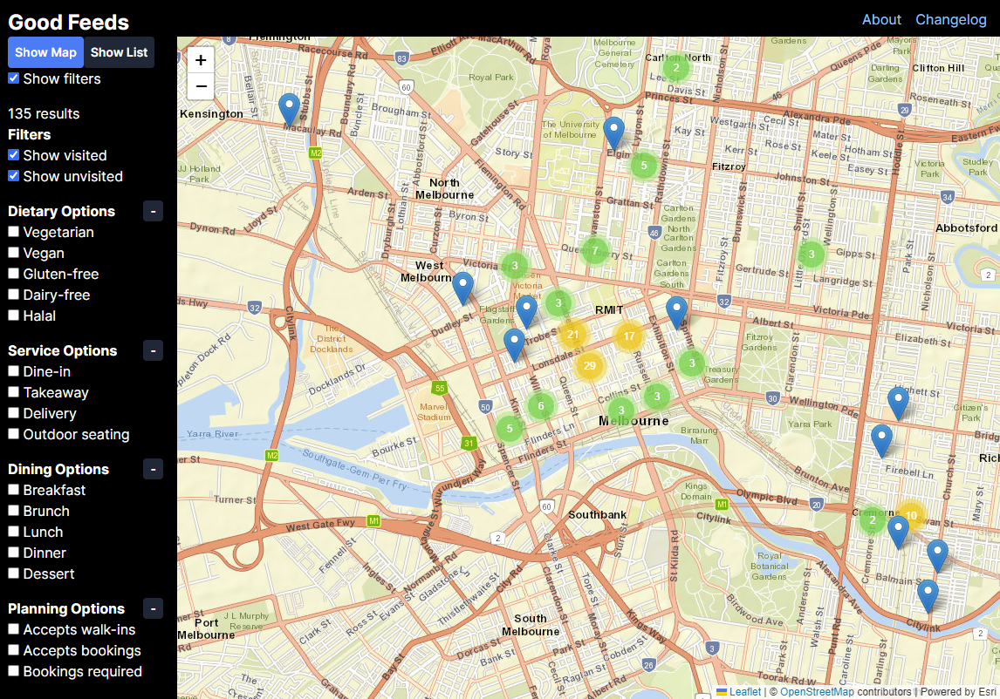

For those looking to skip the story and preamble click [here](#how-i-reverted-a-force-push-to-gh-pages).

Alternatively, you can read [Jamie Tanna's "How to Undo a git push --force"](https://www.jvt.me/posts/2021/10/23/undo-force-push/) post which made this story possible. Thanks Jamie!

---

I accidentally lost a bunch of commits on the `gh-pages` branch for one of my side projects last week.

This side project, [Good Feeds](https://pakkudon.github.io/good-feeds/), is a statically exported Next.js app hosted on GitHub Pages. The deployment process is run locally and looks something like the following:

1. Run `next build` which outputs assets to `dist/` folder
2. Run `gh-pages -t -d dist` to push commit containing changes to `dist/` up to `gh-pages` branch on GitHub
3. GitHub publishes changes from `gh-pages` to https://pakkudon.github.io/good-feeds/

One time after deploying some changes to Good Feeds I noticed that none of the stylesheets or JavaScript had loaded.



I didn't have much time to investigate why the assets were broken, so I decided to try redeploying the previous commit on `gh-pages`. I ran the following:

```sh
git checkout gh-pages
git reset --hard HEAD~1
git push -f origin gh-pages
```

Then I loaded Good Feeds on GitHub Pages only to discover that the project had reverted to a state from about a month ago.



I expected `git checkout gh-pages` to fetch the latest `gh-pages` branch from GitHub as this is not a branch that I typically have checked out locally. Unfortunatel,I had done just that a few weeks ago to backfill the [changelog](https://github.com/PakkuDon/good-feeds/blob/main/CHANGELOG.md) so `git checkout` switched to a stale `gh-pages` branch on my machine. As a result `git reset --hard HEAD~1` had reset `gh-pages` to a commit from January 18.

To fix the version hosted on GitHub Pages I switched back to the `main` branch and ran another deployment using the usual process.

The site was fixed but Good Feed's deployment history now looked something like this:


And the `gh-pages` branch was missing multiple commits from mid-January to mid-February.
```sh
$ git log
Author: PakkuDon <redacted@example.com>
Date:   Thu Feb 15 08:21:11 2024 +1100

    Updates

commit b9578a09b3117de4a703b4881f034d41f05652e0
Author: PakkuDon <redacted@example.com>
Date:   Thu Jan 18 21:46:30 2024 +1100

    Updates
```

Normally I don't care that much about the commits on `gh-pages`. But past commits on this branch are the only way I can see how past releases looked and a month's worth of commits seemed like too many to lose. So I decided to see if there was a way to restore the branch.

# How I reverted a force push to gh-pages
The following requires `git` and [GitHub's CLI](https://cli.github.com/).

First I identified the commit SHA that I wanted to reset `gh-pages` to. I found the commit SHA by looking at [past deployments from github-pages](https://github.com/PakkuDon/good-feeds/deployments/github-pages), but if this isn't available for your project GitHub also [provides an endpoint to list repository events](https://docs.github.com/en/rest/activity/events?apiVersion=2022-11-28#list-repository-events) which includes commit SHAs.

Next, I created a new branch (or ref), `tmp-branch-recover` in Good Feeds' GitHub that pointed to the commit SHA identified in the previous step. I decided to revert back to the previously suspected deploy as I wanted to see if I could replicate the issue.

```sh
$ gh api /repos/PakkuDon/good-feeds/git/refs -f ref=refs/heads/tmp-branch-recover -f sha=986fece15732cd9aba9f7503ee22e226d3063c90
```



I then checked out `tmp-branch-recover` locally and reset `gh-pages` to that branch.
```sh
$ git fetch
$ git checkout tmp-branch-recover
Branch 'tmp-branch-recover' set up to track remote branch 'tmp-branch-recover' from 'origin'.
Switched to a new branch 'tmp-branch-recover'
$ git checkout gh-pages
Switched to branch 'gh-pages'
Your branch is up to date with 'origin/gh-pages'.
$ git reset --hard tmp-branch-recover
HEAD is now at 986fece Updates
```
Both `gh-pages` and `tmp-branch-recover` were now pointing to the same commit.
```sh
$ git log
commit 986fece15732cd9aba9f7503ee22e226d3063c90 (HEAD -> gh-pages, origin/tmp-branch-recover, tmp-branch-recover)
Author: PakkuDon <redacted@example.com>
Date:   Thu Feb 15 08:17:09 2024 +1100

    Updates

commit 7f70cf82b55c7114c1ecad96237d14b185c73542
Author: PakkuDon <redacted@example.com>
Date:   Sun Feb 11 19:40:41 2024 +1100

    Updates

# Other commits truncated
```

Finally I force-pushed `gh-pages` back up to GitHub to correct the previously borked `gh-pages` branch.
```sh
$ git push -f origin gh-pages
Total 0 (delta 0), reused 0 (delta 0), pack-reused 0
To github.com:PakkuDon/good-feeds.git
 + 60fb188...986fece gh-pages -> gh-pages (forced update)
```

The commits in `gh-pages` from January 18 to February 15 had successfully been restored, and Good Feeds was (still) working correctly on GitHub Pages.



As for why the assets were broken in the first place, I haven't found any clues yet. If I had an error tracker configured I would have more info to work with. But that might be a story for another time. 🤔

# References
- [Jamie Tanna's "How to Undo a git push --force"](https://www.jvt.me/posts/2021/10/23/undo-force-push/)
- [REST API endpoints for Git references | GitHub Docs - Create a reference](https://docs.github.com/en/rest/git/refs?apiVersion=2022-11-28#create-a-reference)
- [REST API endpoints for events | GitHub Docs - List repository events](https://docs.github.com/en/rest/activity/events?apiVersion=2022-11-28#list-repository-events)
