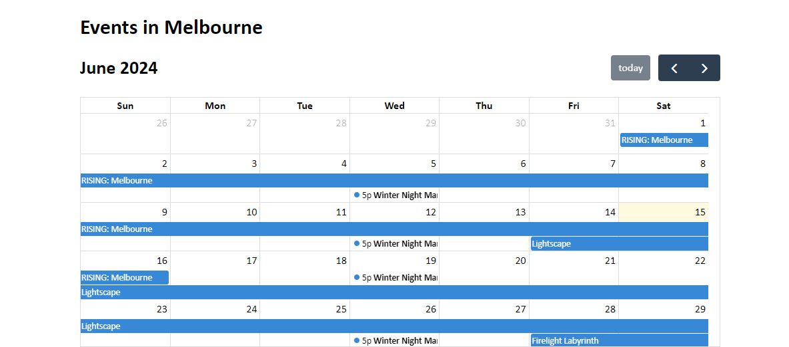

I've been using sites like [What's On Melbourne](https://whatson.melbourne.vic.gov.au/) to find an excuse to get out of the house. If I see an event that looks interesting I'll add it to my calendar so that I can remember they're a thing later on.

I figured someone else might find this useful and I didn't want to share my calendar with the world. So I made a thing:

You can find the calendar live at https://pakkudon.github.io/melbourne-events/

The source code is available at https://github.com/PakkuDon/melbourne-events. I haven't decided if I want to take pull requests on this yet as I just spun up this repository a few hours ago.

A few other notes about this project:
- I used [FullCalendar](https://fullcalendar.io/) for, well, the calendar
- The site is built in plain old HTML, CSS and JavaScript as I don't imagine I'll be adding much more functionality outside of what FullCalendar provides
- The list of events is a hard-coded JavaScript array as I didn't feel like searching for any APIs or scraping any pages today. I intend to add links to other sites where people can find more events if I start to neglect this site

That's all for today. Catch you next time 👋
