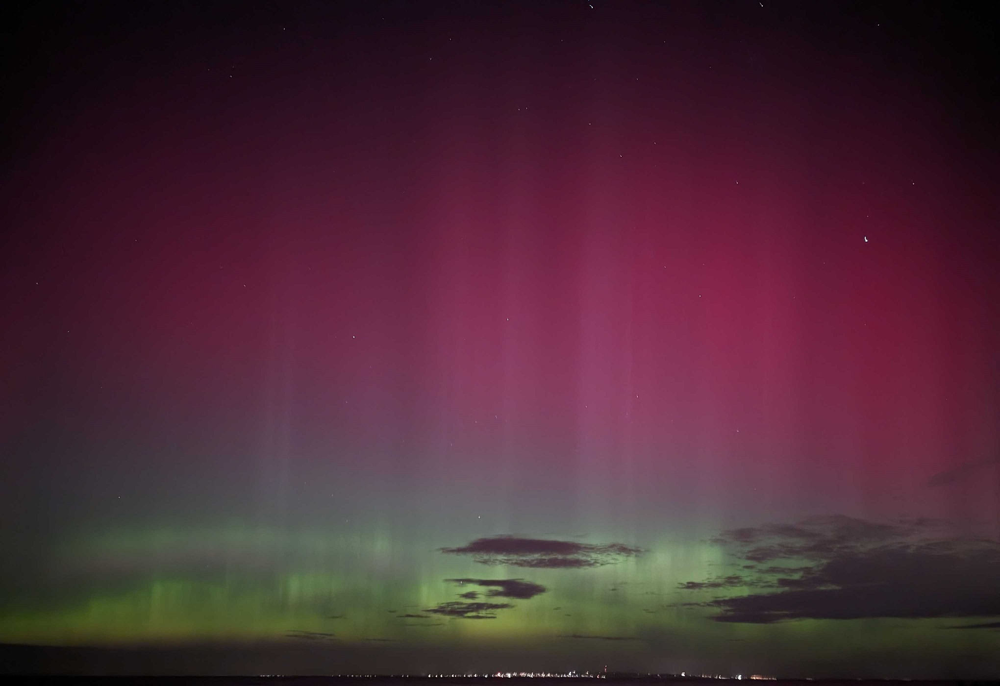

_Last updated: October 12, 2024_

There's been more auroras recently as we're either in or approaching the peak of the [solar cycle](https://www.swpc.noaa.gov/products/solar-cycle-progression). I caught my first aurora during the [G5 geomagnetic storm back in May this year](https://media.bom.gov.au/releases/1225/the-bureau-observes-a-g5-geomagnetic-storm/) and I caught a glimpse of another one from my backyard today.

Here's some resources that I've found useful as someone based in inner Victoria:

## Aurora forecasts and updates
- [Auroral activity | SpaceWeatherLive.com](https://www.spaceweatherlive.com/en/auroral-activity.html) - Aurora-related space weather events and metrics
- [NOAA / NWS Space Weather Prediction Center](https://www.swpc.noaa.gov/) - Current space weather conditions and alerts
  - [Aurora dashboard](https://www.swpc.noaa.gov/communities/aurora-dashboard-experimental) - Aurora oval, past Kp readings and 3-day forecast of Kp index
  - [Real Time Solar Wind](https://www.swpc.noaa.gov/products/real-time-solar-wind)
- [Aurora dashboard | Australian Space Weather Forecasting Centre (ASWFC / BOM)](https://www.sws.bom.gov.au/Aurora) - Current aurora conditions and aurora advisories for Australia
- [Aurora Australis Forecast](https://cdn.softservenews.com/southern_lights.html) - Forecast for Kp index in next few minutes (lead time up to 15 minutes)
- [Aurorasaurus](https://www.aurorasaurus.org/) - Aurora sighting reports
- [Glendale App](https://aurora-alerts.uk/) - Progressive web app with aurora alerts (Registration required maybe?)
- [Real-time AE Index Daily Plot](https://wdc.kugi.kyoto-u.ac.jp/ae_realtime/presentmonth/index.html) - Auroral electrojet index
- [CME Scoreboard](https://kauai.ccmc.gsfc.nasa.gov/CMEscoreboard/) - CME arrival time predictions

## Social media groups and profiles
- [Southern Hemisphere Aurora Group | Facebook](https://www.facebook.com/groups/SouthernHemisphereAuroraGroup/) - Aurora forecasts and sightings from southern hemisphere
- [Southern Hemisphere Aurora Group: Your Aurora Australis Resource for Strength Estimation (SHAG: UPYAARSE) | Facebook](https://www.facebook.com/groups/shagupyaarse/) - Aurora forecasts for southern hemisphere
- [/r/melbourne](https://old.reddit.com/r/melbourne/) - Occasionally has aurora alerts and sightings
- [Vincent Ledvina - 'The Aurora Guy' | Facebook](https://www.facebook.com/vincentledvina/)
- [NOAA Space Weather Prediction Center | Twitter](https://twitter.com/NWSSWPC)

## Other useful resources
- [Satellite Viewer | BOM](http://satview.bom.gov.au/) - Current cloud cover
- [Melbourne forecast | Windy](https://www.windy.com/-37.814/144.963?clouds,-38.305,144.963,8) - Current and predicted cloud cover
- [Light pollution map](https://www.lightpollutionmap.info/)
- [Queenstown, New Zealand Roundshot](https://queenstown.roundshot.com/#/) - Shots of sky from New Zealand. Updated every 20 minutes
- [Mt Buller, Victoria, Australia Roundshot](https://mtbuller.roundshot.com/pendergast-hut/#/) - Shots of sky from Mt Buller, Victoria. Updated every 20 minutes
- [Tamleugh Park | YouTube](https://www.youtube.com/@TamleughPark/streams) - Occasionally has livestreams of sky from north-east Victoria, Australia

## Tips
- [Megathread from @Vincent_Ledvina](https://twitter.com/Vincent_Ledvina/status/1789115700373528875)
- [BOM Weather Guide: Catching the Aurora](https://www.youtube.com/watch?v=0xUF82rVljE)
- [Where to see the Aurora Australis in Melbourne | Time Out](https://www.timeout.com/melbourne/things-to-do/where-to-see-the-aurora-australis-in-melbourne)
- [theauroraguy.com](https://theauroraguy.com/) - Blog posts and guides for chasing auroras
  - [How to predict the aurora - when will it be out?](https://theauroraguy.com/blogs/blog/when-will-the-aurora-be-out)
  - [Where and when can YOU see the aurora?](https://theauroraguy.com/blogs/blog/where-and-when-can-you-see-the-aurora)

That's all for today. Stay safe and happy hunting!

