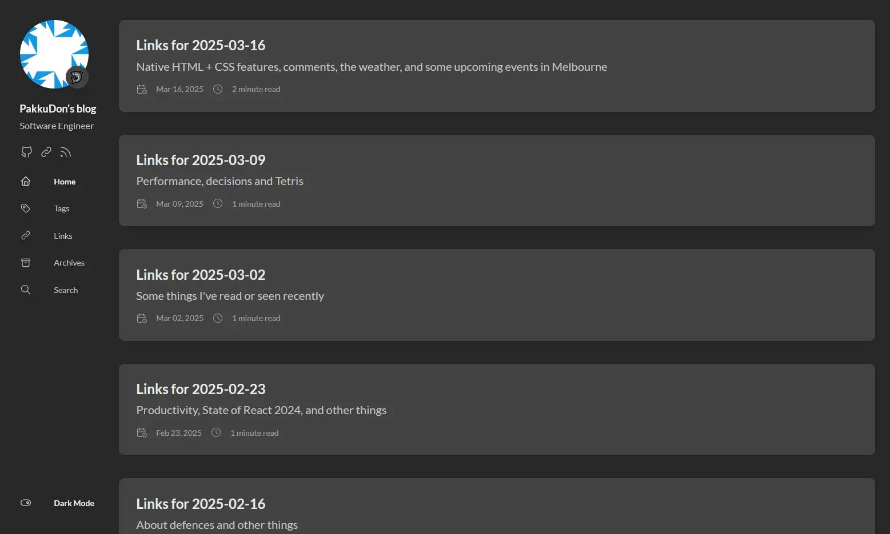

I've been posting link roundups weekly since late last year. On one hand this has pushed me to actually go through some articles or talks that I've bookmarked. On the other hand I post link roundups way more frequently than any other content.

So the blog's index page now looks like this:

Which might be handy if you're looking for stuff to read. But probably less so if you're wondering what sort of blog this is.

I also discovered that Hugo has a concept of [content sections](https://gohugo.io/content-management/sections/). The idea is that we can organise content into different subfolders, and each of those subfolders can have their own index page. The [Stack theme](https://stack.jimmycai.com/config/site#mainsections) used by this blog also allows us to configure which content sections are rendered on the homepage, and it renders `post` content by default.

As of today all link posts have been moved into their own content section and can now be found on the [Links page](/blog/link).

If you're curious you can find the git diff for this change in [this commit](https://github.com/PakkuDon/blog/commit/5afbd9cf81bf73d176c1a4c5297459eeafd955d6).

This also has the side-effect that the previous URLs for link posts are now broken as link content now has a `link` segment in the URL rather than `post`. We could potentially fix that by configuring Hugo to use a `link` segment for link content but I thought that might be confusing as the root link page still has `link` in it. I also assume traffic's low enough so it probably won't matter.

That's all for today. Until next time 👋
