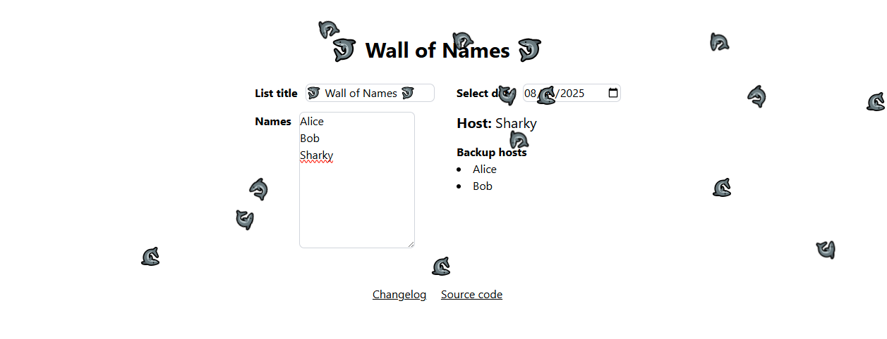

I made a standup roster because I figured it might be useful for work. Then I got bored and added some sharks to it

A few notes about this project:
- This was built using HTML, Tailwind CSS and Vanilla JavaScript
- The title and list of names is stored in the URL as a Base64-encoded string so that the list can be shared by URL
- The list order is based on the distance between the selected date and epoch. So the host and list order should remain consistent for a given date unless the list changes
- Due to either the fact that the list ID is a Base64-encoded value or the fact that the list ID has to be a URL-safe value emojis are not supported at this time 😭. I'm going to need to change this as I have a reputation to upload

You can find Wall of Names at https://pakkudon.github.io/wall-of-names/

Source code can be found on [Github](https://github.com/PakkuDon/wall-of-names)

Until next time 👋