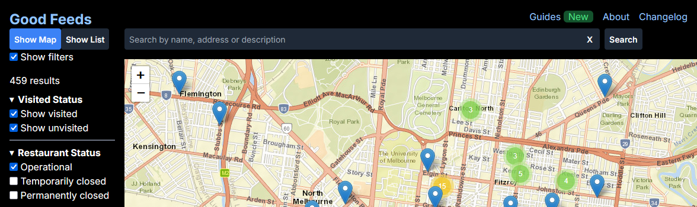
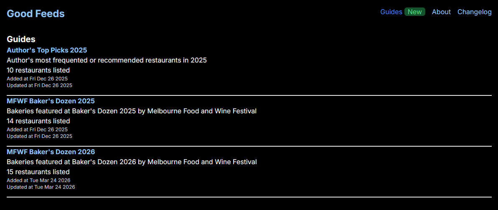
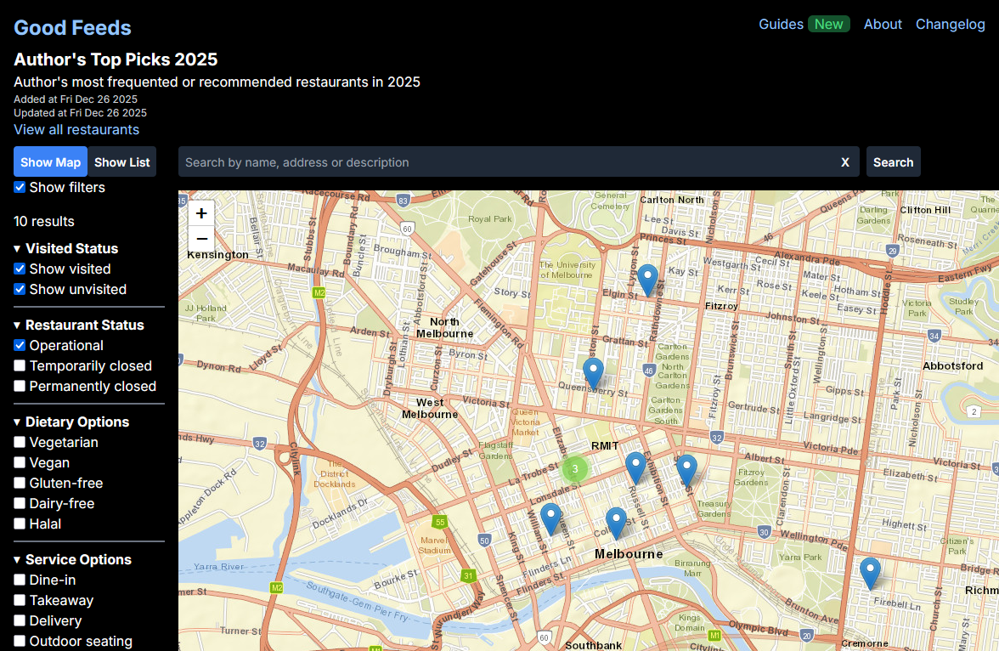

A few months ago [Good Feeds](https://pakkudon.github.io/good-feeds/) reached 500 restaurant listings. So far users have been able to search through these restaurants either by filtering based on dietary needs, service options, or other attributes, or by searching by substring. But I've been lacking a way to group related restaurants together

So there's now a new page to view [guides](https://pakkudon.github.io/good-feeds/guides/), a curated set of restaurants grouped by some sort of theme. These can be found in the navbar

  

This feature takes some inspiration from the guides on [Broadsheet](https://www.broadsheet.com.au/melbourne/directory) and [What's On Melbourne](https://whatson.melbourne.vic.gov.au/search?c=guides&scs[]=eat_and_drink). There's only three guides available so far but there'll be more to come

Patch notes can be found here: [Good Feeds v1.12.0](https://github.com/PakkuDon/good-feeds/blob/main/CHANGELOG.md#1120---2026-03-24)

That's all for now. See you at the next one 👋
