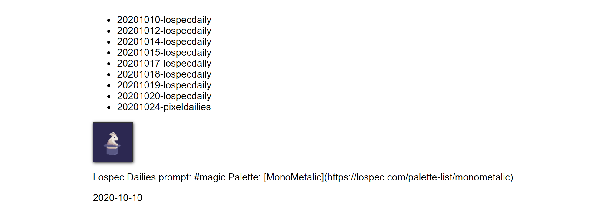

The usual answer I give is that I got into pixel art to get through the lockdowns in 2020. But there's usually other things involved in picking up a new hobby, like learning how to do said hobby, finding inspiration and more.

So here's a longer answer:

I grew up with NES and SNES games so pixel art was a familiar medium. Somehow I stumbled across [The Spriters Resource](https://www.spriters-resource.com/) which had sprite sheets for all these classic games I knew. My first somewhat-real experience with pixel art was recolouring and modifying sprites taken from that site in an attempt to learn how to replicate their style. I lost these early attempts due to a hard drive failure but those attempts made me appreciate how much could be expressed in so few pixels.

Over time I found [/r/PixelArt](https://reddit.com/r/PixelArt/) and [Twitter's #pixelart hashtag](https://twitter.com/hashtag/pixelart). On Twitter (or X) I started following pixel artists like [@waneella_](https://twitter.com/waneella_), [Jubilee (@16pxl)](https://twitter.com/16pxl), [@SalamiChild](https://twitter.com/SalamiChild) and many more. Up until this point I had primarily seen pixel art in the context of sprites and video games. By following these artists and communities I started to see how pixel art could be its own thing.

I tried replicating some scenery from photos I had taken. I dove right in and had no idea what I was doing. I didn't know what canvas size I should use or how to choose a good colour palette. I tried using something like a 200x150px canvas but that failed because that's way too many pixels to deal with as a beginner.

At some point I noticed that /r/PixelArt had a link to [Lospec's Pixel Art: Where to Start](https://lospec.com/articles/pixel-art-where-to-start/) guide. Lospec also had a [collection of palettes](https://lospec.com/palette-list) and its own [pixel art editor](https://lospec.com/pixel-editor) which had a default size of 64x64px - a much more approachable canvas size than my previous attempt.

I started practicing pixel art by completing [Lospec Dailies](https://lospec.com/dailies/) and [Pixel Dailies](https://twitter.com/Pixel_Dailies). At first I used Lospec's pixel art editor but then switched to [GIMP](https://www.gimp.org/) as it was free and seemed to have more features. 

I also used this hobby to start a new side project, a [pixel art gallery](https://github.com/PakkuDon/pixel-art-gallery), so that I could host my pixel art and share it with people I knew. Thanks to their encouragement and support I've posted 400+ pixel art entries. Maybe one day I'll feel confident enough to share my art with the broader community. But for now, this will do. :D

_[Pixel Art Gallery](https://github.com/PakkuDon/pixel-art-gallery) on November 1 2020 [(commit cf37d41)](https://github.com/PakkuDon/pixel-art-gallery/tree/cf37d41db7f965e49fa8a3245699b068c92d9f09). First iteration where pixel art images were displayed_

So what advice could I give to someone thinking of getting into pixel art? These have likely been said elsewhere, but here's some of my thoughts:

- Start small. The more details you try to include or the larger your canvas, the longer it's going to take to finish drawing. I found 64x64px to be a comfortable canvas size to start with, but 32x32px or 16x16px canvases are also common.
- Follow pixel artists and join some communities. You can learn a lot from seeing how other people draw.
- Find some tutorials. There's plenty on Twitter, YouTube or other social media platforms.
- Keep practicing. Progress is not always linear but your skills will improve over time.
- Most importantly, have fun! Hobbies are not meant to be stressful. Take things at your own pace. At the end of the day we're all in this capitalist hellscape together. 🔥

Thanks for reading this post. See you at the next one! 👋
